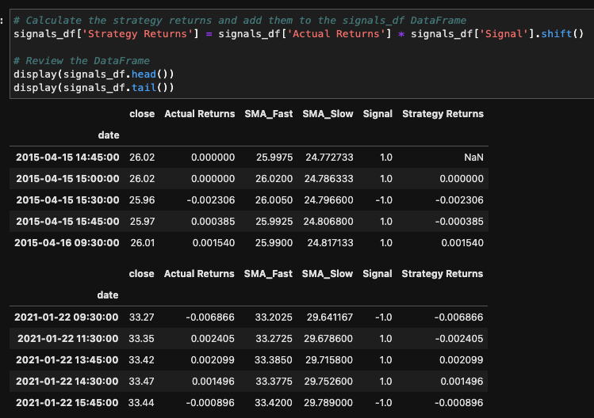
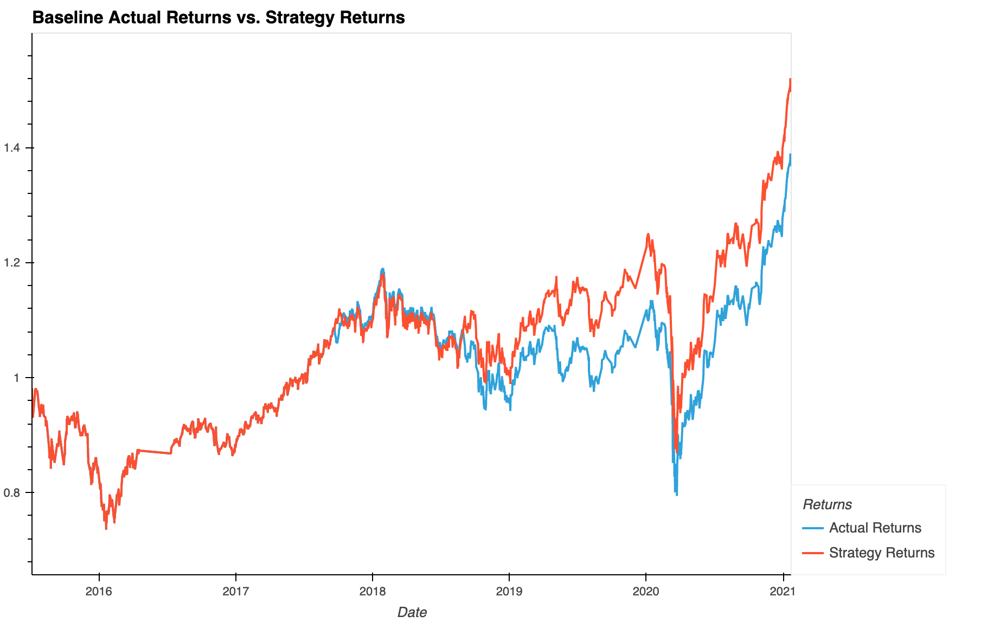
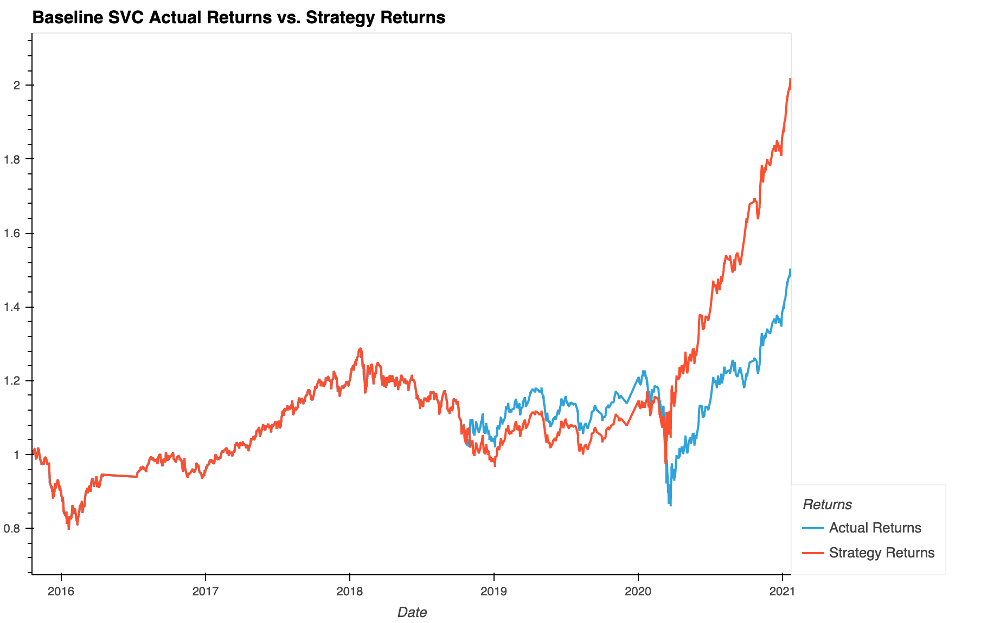
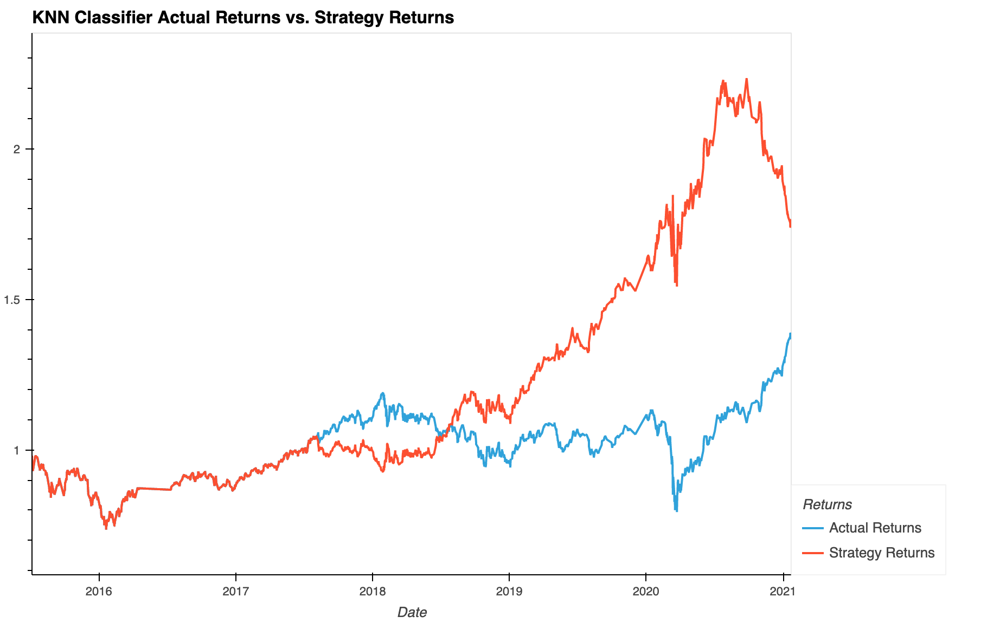

# SMA Machine Learning Algorithmic Trading - UW Fintech Bootcamp Module 14 Challenge

In this project I combine the Dual Moving Average Crossover (DMAC) trading strategy with machine learning models to create a trading algorithm that predicts trade entry/exit signals using two Simple Moving Averages (SMA). 

### Data Used
[emergin_markets_ohlcv.csv](./Resources/emerging_markets_ohlcv.csv) - OHLCV data for an MSCI–based emerging markets ETF

---

## Overview of the Analysis

This analysis compares three different machine learning models that are trained using two features, which are the dual SMAs, and try to predict the entry/exit positions to attempt to create a profitable trading algorithm. Using the OHLCV data, I generate metrics like the fast and slow SMAs, the trading signal, and the strategy returns if we had simply bought and sold based on positive and negative daily return values. 

Then, I create a feature set out of the two SMAs and use the trading signals as the labels. I then split the data into training and testing sets based on a DateOffset() value and then scale the training sets using scikit-learn's StandardScaler(). 

With this format of data I then create the three different models: 
1. Baseline SVC (Support Vector Classifier) model with the following hyperparameters: 
    * 4-day fast SMA 
    * 100-day long SMA 
    * 3 month DateOffset() value meaning 3 months of training data
2. Hyperparameter-tuned SVC model: 
    * 4-day fast SMA 
    * 150-day long SMA 
    * 6 month DateOffset()
3. KNN (K Nearest Neighbors) Classifier model with baseline hyperparameters

I compare each of these models to look at how different models and hyperparameters change the resulting cumulative return, accuracy, and f1-scores values. 

## Results

### Baseline SVC Model 

* Strategy final cumulative return - 1.520
* Actual final cumulative return - 1.389
* Accuracy - 0.55

### Hyperparameter-Tuned Baseline SVC Model

* Strategy final cumulative return - 2.018
* Accuracy - 0.56

### KNN Classifier Model (Baseline Hyperparameters)

* Strategy final cumulative return - 1.750
* Accuracy - 0.52

## Summary

When coming up with these results I found that hyperparameter tunings and model changes each had their own "sweetspots" where even the slight deviations from those sweetspots could result in drastically worse results. Using different DateOffsets() like 6-7 months of training data seemed to be the only positive changes whereas anything above or below would result in poor cumulative returns. Changing the fast and slow SMA values had a bit more room to experiment with since you could use short values of 1, 3, 4, or 6 and long values of 90, 120, 140, or 150. Changing these values would normally improve upon the final baseline SVC cumulative return of 1.520, and the highest I was able to get that value to was 2.018 with a fast SMA of 4, long SMA of 150, and 6-months of training data. The hyperparameter tuned SVC would for the most part be a better model than the baseline one because it has a lower worst-case return and a much higher best-case return. The only downside being that it spends much of its time being either equal or below the actual returns, which is offset by the final span of upward trending returns. 

Using different models with the baseline hyperparameters can also provide mostly worse results or results that don't do notably better than the actual returns. However, K nearest neighbors classifier and K nearest centroid both provided decent cumulative returns. The KNN classifier had a better final cumulative return so I stuck with that one, but both got around a 1.6-1.7 final cumulative return. Although the final cumulative return is not better than the hyperparameter-tuned SVC, it is worth noting that the highest return that it had was 2.29. This can be offset by the lowest possible return of 0.92 compared to the hyperparameter-tuned SVC having a low of 0.966. It is also worth mentioning that the KNN classifier ends in a downward trend while the hyperparameter-tuned SVC ends with a very long upward trend. The accuracy values were generally close with the KNN classifier at 0.52 and the hyperparameter-tuned SVC at 0.56, however the hyperparameter-tuned SVC had a horrible f1-score for predicting exit signals at 0.06, while the KNN classifier had 0.38. Recall or precision may or may not be as important since all of the good models I experimented with could only reach around a 0.5 accuracy anyway. Further experimenting with the KNN classifier's hyperparameters could be explored for potentially higher cumulative returns. 

---

## Technologies

This is a Python 3.7 project ran in Google Colab but can be used in JupyterLab using a Conda dev environment. 

The following dependencies are used: 
1. [Jupyter](https://jupyter.org/) - Running code 
2. [Conda](https://github.com/conda/conda) (4.13.0) - Dev environment
3. [Pandas](https://github.com/pandas-dev/pandas) (1.3.5) - Data analysis
4. [Matplotlib](https://github.com/matplotlib/matplotlib) (3.5.1) - Data visualization
5. [Numpy](https://numpy.org/) (1.21.5) - Data calculations + Pandas support
6. [Scikit-learn](https://scikit-learn.org/stable/index.html) (1.1.3) - Machine learning tools and methods

---

## Installation Guide

If you would like to run the program in JupyterLab, install the [Anaconda](https://www.anaconda.com/products/distribution) distribution and run `jupyter lab` in a conda dev environment.

To ensure that your notebook runs properly you can use the [requirements.txt](/Resources/requirements.txt) file to create an exact copy of the conda dev environment used in development of this project. 

Create a copy of the conda dev environment with `conda create --name myenv --file requirements.txt`

Then install the requirements with `conda install --name myenv --file requirements.txt`

---

## Usage

The Jupyter notebook [machine_learning_trading_bot.ipynb](./machine_learning_trading_bot.ipynb) will provide all steps of the data collection, preparation, and analysis. Data visualizations are shown inline and accompanying analysis responses are provided.

---

## Contributors

[Ethan Silvas](https://github.com/ethansilvas)

---

## License

This project uses the [GNU General Public License](https://choosealicense.com/licenses/gpl-3.0/)