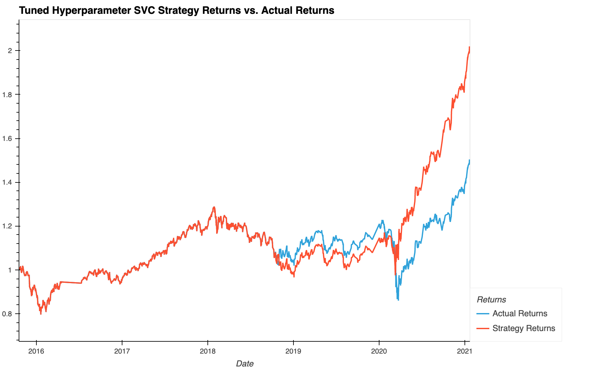

# SMA Machine Learning Algorithmic Trading - UW Fintech Bootcamp Module 14 Challenge

In this project I combine the Dual Moving Average Crossover (DMAC) trading strategy with machine learning models to create a trading algorithm that predicts trade entry/exit signals using two Simple Moving Averages (SMA). 

### Data Used
[emergin_markets_ohlcv.csv](./Resources/emerging_markets_ohlcv.csv) - OHLCV data for an MSCI–based emerging markets ETF

---

## Overview of the Analysis

This analysis compares three different machine learning models that are trained using two features, which are the dual SMAs, and try to predict the entry/exit positions to attempt to create a profitable trading algorithm. Using the OHLCV data, I generate metrics like the fast and slow SMAs, the trading signal, and the strategy returns if we had simply bought and sold based on positive and negative daily return values. 

Then, I create a feature set out of the two SMAs and use the trading signals as the labels. I then split the data into training and testing sets based on a DateOffset() value and then scale the training sets using scikit-learn's StandardScaler(). 

With this format of data I then create the three different models: 
1. Baseline SVC (Support Vector Classifier) model with the following hyperparameters: 
    * 4-day fast SMA 
    * 100-day long SMA 
    * 3 month DateOffset() value meaning 3 months of training data
2. Hyperparameter-tuned SVC model: 
    * 4-day fast SMA 
    * 150-day long SMA 
    * 6 month DateOffset()
3. KNN (K Nearest Neighbors) Classifier model with baseline hyperparameters

I compare each of these models to look at how different models and hyperparameters change the resulting cumulative return, accuracy, and f1-scores values. 

## Results

### Baseline SVC Model 

### Hyperparameter-Tuned Baseline SVC Model

### KNN Classifier Model (Baseline Hyperparameters)

## Summary

---

## Technologies

This is a Python 3.7 project ran in Google Colab but can be used in JupyterLab using a Conda dev environment. 

The following dependencies are used: 
1. [Jupyter](https://jupyter.org/) - Running code 
2. [Conda](https://github.com/conda/conda) (4.13.0) - Dev environment
3. [Pandas](https://github.com/pandas-dev/pandas) (1.3.5) - Data analysis
4. [Matplotlib](https://github.com/matplotlib/matplotlib) (3.5.1) - Data visualization
5. [Numpy](https://numpy.org/) (1.21.5) - Data calculations + Pandas support
6. [Scikit-learn](https://scikit-learn.org/stable/index.html) (1.1.3) - Machine learning tools and methods

---

## Installation Guide

If you would like to run the program in JupyterLab, install the [Anaconda](https://www.anaconda.com/products/distribution) distribution and run `jupyter lab` in a conda dev environment.

To ensure that your notebook runs properly you can use the [requirements.txt](/Resources/requirements.txt) file to create an exact copy of the conda dev environment used in development of this project. 

Create a copy of the conda dev environment with `conda create --name myenv --file requirements.txt`

Then install the requirements with `conda install --name myenv --file requirements.txt`

---

## Usage

The Jupyter notebook  will provide all steps of the data collection, preparation, and analysis. Data visualizations are shown inline and accompanying analysis responses are provided.

---

## Contributors

[Ethan Silvas](https://github.com/ethansilvas)

---

## License

This project uses the [GNU General Public License](https://choosealicense.com/licenses/gpl-3.0/)